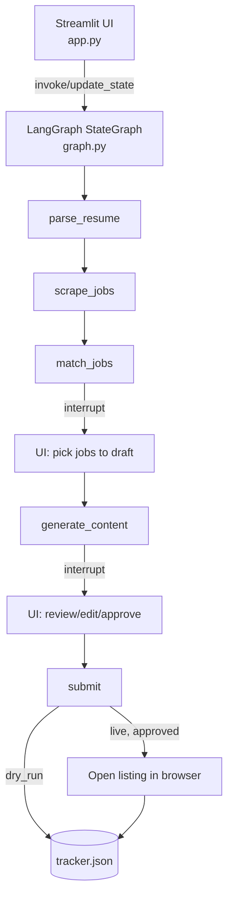
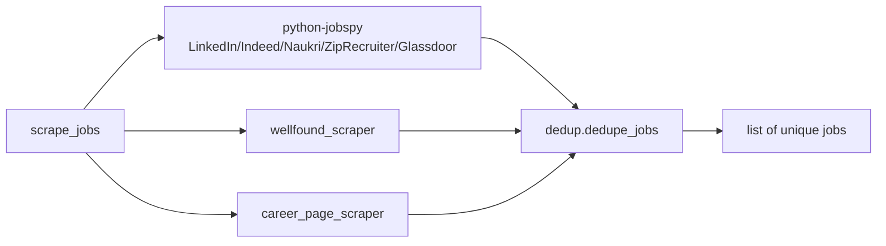

# Architecture

Audited against local checkout `0d328db9d8dbbfaffe5104c19c1ae7732e3d81dd` on `main`
(remote `https://github.com/pypi-ahmad/autonomous-job-application-agent.git`), 2026-08-17.
Local license: MIT (`LICENSE`). This document is cited to files in this checkout;
see [Footnotes](#footnotes) for the full list.

## Part 1 — Whole-repo technical deep-dive

**What this is.** A local, single-user Streamlit application that runs a LangGraph
state-machine pipeline: parse a resume, scrape job boards, score matches, draft and
polish application content, pause twice for human review, then either log a dry-run
result or open approved listings in the browser for manual submission (README.md:3,
graph.py:129-149).

### Tech stack

| Layer | Technology | Evidence |
|---|---|---|
| UI | Streamlit | `app.py:8,20` |
| Orchestration | LangGraph `StateGraph` + `MemorySaver` checkpointer, 2 interrupt points | `graph.py:8-9,146-149` |
| LLM integration | LangChain (`langchain-core`, `-openai`, `-google-genai`, `-ollama`) | `tools/llm_factory.py:6-8`, `requirements.txt:3-6` |
| Job scraping | `python-jobspy` (LinkedIn/Indeed/Naukri/ZipRecruiter/Glassdoor), custom Wellfound + career-page scrapers | `tools/job_scraper.py:9,17`, `tools/wellfound_scraper.py`, `tools/career_page_scraper.py` |
| Resume parsing | `pypdf`, `python-docx` | `parsers/resume_parser.py:13-15` |
| Persistence | flat JSON (`data/tracker.json`) + CSV export, no database | `tools/tracker.py:10,80` |
| Config | `python-dotenv`, plain `os.environ` reads | `config.py:8-21` |

### Entry point

`streamlit run app.py` (README.md:98) or `run.cmd` (Windows one-click: creates
`.venv`, installs deps, copies `.env.example` → `.env`, launches — README.md:75-80).
`app.py:392-422` is the only UI entry point; there is no CLI or API entry point.

### Commands & Verification Inventory

| Command | Purpose | Evidence |
|---|---|---|
| `pip install -r requirements.txt` | Install pinned-by-name (not pinned-by-version) deps | `requirements.txt` (no version pins except `numpy>=2.1`) |
| `pip install --no-deps python-jobspy` | Install jobspy without pulling its incompatible `numpy==1.26.3` pin back in | `requirements.txt:20-24`, README.md:93-95 |
| `streamlit run app.py` | Run the app | README.md:98 |
| `run.cmd` | Windows one-click setup + launch | README.md:77-80 |

**No lint, format, typecheck, test, or CI command exists.** `[UNVERIFIED→CONFIRMED]`:
no `pyproject.toml`, no `pytest.ini`/`tox.ini`, no `.github/workflows/`, no lockfile
(`uv.lock`/`poetry.lock`/`Pipfile.lock`) anywhere in the checkout (confirmed via
directory listing, 2026-08-17). This is not an inference — it is the complete absence
of those files. CI enforcement (required status checks) is therefore also absent,
not just unconfirmed.

**Informal self-checks already exist**, just not collected by any test runner:
`utils.py:22-31`, `tools/dedup.py:43-52`, `agents/resume_advisor.py:33-44`, and
`agents/matcher.py:128-153` each define a `demo()` function with real `assert`
statements, run via `if __name__ == "__main__"`. Re-run 2026-08-17: all four pass
(`utils.demo`, `dedup.demo`, `resume_advisor.demo`, `matcher.demo` — verified live,
not inferred).

### Directory layout

| Path | Purpose |
|---|---|
| `app.py` | Streamlit UI: sidebar config, 3-step pipeline tab, tracker tab |
| `graph.py` | LangGraph node functions + `build_graph()` |
| `state.py` | `AgentState`/`GeneratedContent` `TypedDict` schema |
| `config.py` | Env var reads, model/site constants, `list_ollama_models()` |
| `utils.py` | Logging setup, `strip_code_fences()` (LLMs sometimes wrap JSON in markdown fences) |
| `agents/matcher.py` | Multi-factor match scoring (5 LLM-judged factors + 1 deterministic) |
| `agents/writer.py` | Cover-letter/screening-answer drafting + polishing prompts |
| `agents/resume_advisor.py` | Pure-function resume-profile analytics (no LLM) |
| `parsers/resume_parser.py` | PDF/DOCX text extraction + LLM structuring |
| `tools/llm_factory.py` | Provider → `BaseChatModel` construction |
| `tools/job_scraper.py` | Parallel multi-source aggregation + dedup |
| `tools/wellfound_scraper.py` | Best-effort Wellfound SSR-payload scraping |
| `tools/career_page_scraper.py` | LLM-based career-page job extraction |
| `tools/dedup.py` | Cross-source near-duplicate merging (O(n²), by design at this scale) |
| `tools/company_research.py` | DuckDuckGo HTML scraping + LLM synthesis |
| `tools/tracker.py` | JSON-file CRM: status lifecycle, timeline, CSV export |
| `data/` | Runtime-only: uploads, `tracker.json`, CSV export. Not committed. |

### Deployment & Runtime Surface

Local-only; there is no container, no CI runner image, and no deployed service.
`README.md:5` badges Python 3.11+; the installed dev environment (`.venv`) is
Python 3.13.15 (confirmed live, 2026-08-17). No `.python-version`/`runtime.txt`
pins an exact interpreter — the floor is asserted only in a README badge, not
enforced anywhere.

### EOL / dead-dependency scan

Nothing EOL. LangGraph, LangChain, Streamlit, and the provider SDKs are all current
generations `[INFERRED from requirements.txt's unpinned names — no version can be
EOL-checked without pinning]`. The one known-fragile dependency is intentional and
documented: `python-jobspy` pins `numpy==1.26.3`, incompatible with modern Python
on Windows, worked around via `--no-deps` (requirements.txt:20-24). `tools/wellfound_scraper.py:1-6`
and `tools/career_page_scraper.py:1-6` self-document as best-effort/fragile by
design (scrape a JS SSR payload / arbitrary page markup with no stable contract).

### Data, APIs, background jobs, CI/CD, testing

- **Data:** flat JSON file (`data/tracker.json`) is the only persistence; no
  database, no schema migrations possible or needed at this scale (`tools/tracker.py`).
- **APIs:** none exposed by this app; it is a client of four LLM provider APIs
  (OpenAI-compatible, Agnes AI, Google Gemini, local Ollama — `tools/llm_factory.py:13-36`)
  and scrapes public job-board/search HTML.
- **Background jobs:** none; `ThreadPoolExecutor` is used only for one-shot
  parallel fan-out within a single scrape call (`tools/job_scraper.py:79-89`), not
  a persistent worker.
- **CI/CD:** none exists (see Commands inventory above).
- **Testing:** none collected; four `demo()` self-checks exist but require manual
  invocation (see above).

## Part 2 — Context & ecosystem

**Identity:** remote `pypi-ahmad/autonomous-job-application-agent`, branch `main`,
HEAD `0d328db9`, MIT-licensed, public.

**Repo-specific contributor docs (added this session, not by this pass):**
`CONTRIBUTING.md`, `SECURITY.md`, `SUPPORT.md`, `DISCLAIMER.md`. `CONTRIBUTING.md`
already states the two rules any modernization work here must preserve: keep the
project local-first (no telemetry/hosted backend) and preserve the dry-run/`SUBMIT`
safety gate (`CONTRIBUTING.md`).

**Developer gotchas:**
- `python-jobspy`'s `--no-deps` install order is load-bearing — installing it
  normally reintroduces the broken `numpy==1.26.3` pin on modern Python/Windows
  (`requirements.txt:20-24`).
- `agents/matcher.py:13-15` and `tools/dedup.py:8-10` both carry `ponytail:`
  comments naming a known scaling ceiling (sequential per-job LLM calls;
  O(n²) dedup) that's fine at the app's current "hundreds of jobs" scale but
  would need revisiting if that scale changes materially.
- `tools/tracker.py:80` and `app.py:22-23` both hardcode `data/...` relative
  paths — the app must be run from the repo root.

**Ecosystem:** standalone; no sibling services, no shared package, no monorepo.

## Part 3 — Architectural blueprint

**Layering:** `app.py` (UI) → `graph.py` (orchestration) → `agents/` + `tools/` +
`parsers/` (domain logic) → `config.py` (env). Nothing in `agents/`, `tools/`, or
`parsers/` imports `app.py` or `graph.py` — the dependency direction is one-way,
enforced only by convention (no import-linter/architecture test exists).

**Cross-cutting concerns**

| Concern | Location | Evidence |
|---|---|---|
| Config/secrets | `.env` via `python-dotenv`, read once at import time | `config.py:8-21` |
| Logging | stdlib `logging`, one shared `"job_agent"` logger | `utils.py:8-10`, used across `tools/*.py` |
| Error handling | broad `except Exception` around every network call, logged and degraded to `[]`/empty dict | `tools/job_scraper.py:83-88`, `tools/wellfound_scraper.py:33-43`, `tools/career_page_scraper.py:37-42`, `tools/company_research.py:39-50` |
| Safety gate | dry-run default + typed `SUBMIT` confirmation + browser-open-only (never auto-fill/auto-submit) | `graph.py:102-126`, `app.py:310-322` |

**Inferred ADRs**

- **ADR: Draft locally, polish remotely.** *Context:* cover letters/answers need
  both cost control and quality. *Decision:* draft with a free local Ollama model,
  polish with one configured paid API model (`app.py:98-108`, `graph.py:52-95`).
  *Consequences:* quality depends on the local model's draft; failure of the local
  Ollama server blocks the whole `generate_content` step.
- **ADR: Never auto-submit.** *Context:* automating real submission needs per-site
  login + CAPTCHA handling and risks ToS violations. *Decision:* open the listing
  in the browser for the human to submit (`graph.py:117-120`, comment in source).
  *Consequences:* the tracker's "Submitted" status only ever means "opened," not
  "confirmed sent" — a known, documented limitation, not a bug.
- **ADR: Deterministic keyword score alongside LLM judgment.** *Context:* trusting
  an LLM for every match factor makes the score unauditable. *Decision:* compute
  `keywords` via Jaccard-style token overlap in code; let the LLM judge the other
  five factors (`agents/matcher.py:37-44,106-113`). *Consequences:* one factor is
  fully explainable/reproducible; the other five vary run-to-run.

**Governance:** none yet — no CODEOWNERS, no branch protection, no required CI
(see Modernization plan).

**How to add a feature:** add/modify a node function in `graph.py`, wire it into
`build_graph()`'s edges, extend `AgentState` in `state.py` if new fields are
needed, and update `README.md`'s "How It Works" pipeline diagram and project
structure tree in the same change (nothing currently enforces this — it's
convention only).

## Subsystem deep-dives

### 1. The LangGraph pipeline (`graph.py`)

Six nodes in a strict linear chain with two `interrupt_before` pause points
(`graph.py:129-149`). State is a single `TypedDict` (`state.py:18-29`) threaded
through every node and persisted by `MemorySaver`, keyed on a UUID `thread_id`
stored in `st.session_state` (`app.py:29-30,37-38`) — so state survives Streamlit's
rerun-on-every-interaction model. `log` is the one field with a reducer
(`operator.add`, `state.py:29`); every other field is fully overwritten by each
node's return dict. `node_human_approval` (`graph.py:98-99`) is a deliberate no-op
— it exists only to be an interrupt point the UI can detect via `graph.get_state(rc()).next`
(`app.py:403-407`).

### 2. Multi-source job aggregation + dedup (`tools/job_scraper.py`, `tools/dedup.py`)

Three independent sources run concurrently via `ThreadPoolExecutor`
(`tools/job_scraper.py:79-89`): `python-jobspy` for the five mainstream boards,
a custom Wellfound scraper, and an LLM-based career-page extractor. Each source
fails independently and silently degrades to `[]` on exception — one source
failing never blocks the others. Results merge into one list, then
`dedupe_jobs()` (`tools/dedup.py:16-40`) does company-exact-match +
title-fuzzy-match (`difflib.SequenceMatcher`, threshold 0.88) to merge
cross-source duplicates into a `sources: [...]` list on one surviving record.
This is O(n²) by construction — a documented, accepted ceiling at "hundreds of
jobs" scale (`tools/dedup.py:8-10`).

### 3. Multi-factor match scoring (`agents/matcher.py`)

One LLM call per job returns five 0-100 factor scores plus pros/cons/gaps/
suggestions as JSON (`agents/matcher.py:52-104`); a sixth factor (`keywords`) is
computed deterministically via token-overlap before the weighted sum
(`agents/matcher.py:37-44,106-114`, weights at lines 16-23). This hybrid — one
factor grounded in code, five in LLM judgment — is the project's most
consequential design choice: it trades full explainability for judgment quality
on the harder-to-formalize factors (domain fit, seniority fit).

## Confidence assessment

| Claim area | Confidence |
|---|---|
| Pipeline structure, node responsibilities, interrupt points | High — read directly from `graph.py` |
| No CI/tests/lockfile exists | High — confirmed by directory listing and successful local run, not inference |
| Matching formula and weights | High — read directly from `agents/matcher.py` |
| Dependency versions being "current" (no EOL) | Inferred — `requirements.txt` has no version pins to check against advisory databases |
| CI enforcement status if CI is added later | N/A — no CI exists yet |
| Scale ceilings (O(n²) dedup, sequential LLM calls) being acceptable today | High — directly stated in source comments by the original author, re-confirmed by re-reading the code paths |

## Footnotes

- `README.md` — features, tech stack, setup, env vars, architecture narrative
- `graph.py` — LangGraph node functions and `build_graph()`
- `state.py` — `AgentState`/`GeneratedContent` schema
- `config.py` — env var reads and constants
- `app.py` — Streamlit UI and pipeline wiring
- `agents/matcher.py`, `agents/writer.py`, `agents/resume_advisor.py` — matching, drafting, resume analytics
- `parsers/resume_parser.py` — resume text extraction and structuring
- `tools/job_scraper.py`, `tools/wellfound_scraper.py`, `tools/career_page_scraper.py`, `tools/dedup.py`, `tools/company_research.py`, `tools/tracker.py`, `tools/llm_factory.py` — scraping, dedup, research, persistence, provider construction
- `utils.py` — logging setup and LLM-output cleanup
- `requirements.txt` — dependency list (unpinned)
- `CONTRIBUTING.md` — safety-gate and local-first rules this plan must preserve
