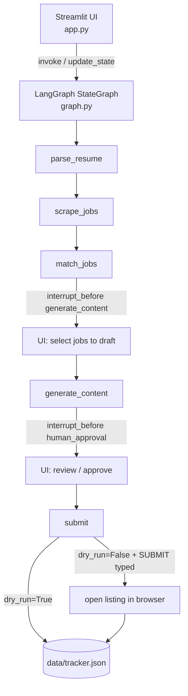
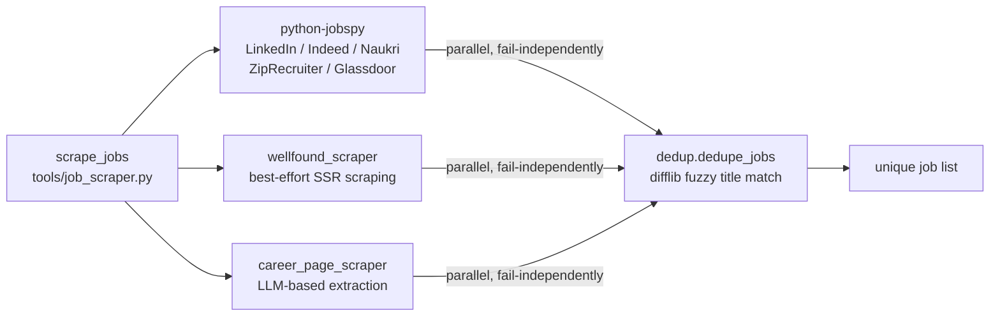

# Architecture

> For the full audit document with confidence assessments, ADRs, and subsystem deep-dives, see [ARCHITECTURE.md](../ARCHITECTURE.md) at the repo root.

## Pipeline overview

A single LangGraph `StateGraph` with six nodes in a strict linear chain and two `interrupt_before` pause points that hand control back to the Streamlit UI. State survives across Streamlit reruns via a `MemorySaver` checkpointer keyed on a UUID `thread_id` stored in `st.session_state`.



## Job aggregation

Three independent sources run concurrently via `ThreadPoolExecutor`; each fails independently and silently degrades to `[]`.



## Main types

| Type | File | Description |
|---|---|---|
| `AgentState` | `state.py:18` | `TypedDict` — the single mutable object threaded through every node |
| `GeneratedContent` | `state.py:9` | Per-job output: cover letter, screening answers, approval status, comment, tone |

`AgentState.log` is the only field with a reducer (`operator.add`); all other fields are fully overwritten by each node's return dict.

## Node responsibilities

| Node | File | What it does |
|---|---|---|
| `parse_resume` | `graph.py:20-23` | Extracts text from PDF/DOCX, asks local LLM to structure it into skills / experience / achievements |
| `scrape_jobs` | `graph.py:26-41` | Runs jobspy, Wellfound, and career-page fetches concurrently; deduplicates results |
| `match_jobs` | `graph.py:44-49` | Scores every job (one LLM call per job) and sorts by overall match descending |
| `generate_content` | `graph.py:52-95` | Fetches/caches company research, drafts locally, polishes with the configured API model |
| `human_approval` | `graph.py:98-99` | Deliberate no-op — exists only as the second interrupt point |
| `submit` | `graph.py:102-126` | Dry-run: records outcome. Live: opens each approved listing in the browser |

## Match scoring formula

```
overall = 0.30 · skills + 0.20 · experience + 0.15 · domain
        + 0.15 · keywords + 0.10 · seniority + 0.10 · location
```

The `keywords` factor is computed deterministically (Jaccard-style token overlap between resume text and job description — `agents/matcher.py:37-44`). The other five come from a single structured LLM call per job that also returns pros/cons, skill gaps, and resume suggestions.

## External systems

| System | Transport | Where |
|---|---|---|
| Ollama (local models) | HTTP via `ChatOllama` | `tools/llm_factory.py:14-15` |
| OpenAI-compatible endpoint | `ChatOpenAI`, configurable `base_url` | `tools/llm_factory.py:17-23` |
| Agnes AI | `ChatOpenAI` at `https://apihub.agnes-ai.com/v1` | `tools/llm_factory.py:25-31` |
| Google Gemini | `ChatGoogleGenerativeAI` | `tools/llm_factory.py:33-34` |
| LinkedIn / Indeed / Naukri / ZipRecruiter / Glassdoor | `python-jobspy` | `tools/job_scraper.py:24` |
| Wellfound | `requests` + BeautifulSoup (best-effort) | `tools/wellfound_scraper.py` |
| Company career pages | `requests` + LLM extraction | `tools/career_page_scraper.py` |
| DuckDuckGo HTML search | `requests` (no API key) | `tools/company_research.py` |

## Dependency direction

```
app.py               UI only
  └── graph.py       orchestration
        ├── agents/  matching, writing, resume analytics
        ├── parsers/ resume extraction
        └── tools/   scraping, dedup, research, persistence, LLM factory
              └── config.py  env reads, constants
```

Nothing in `agents/`, `tools/`, or `parsers/` imports `app.py` or `graph.py`. The dependency direction is one-way, enforced by convention only.

## Persistence

Only one file is written to disk at runtime: `data/tracker.json` (flat JSON array, read and rewritten in full on every mutation). No database; no schema migrations. See [TECHNICAL.md](TECHNICAL.md) for the full persistence inventory.
